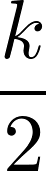
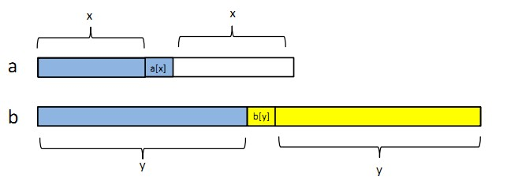
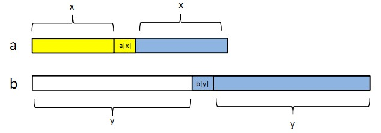
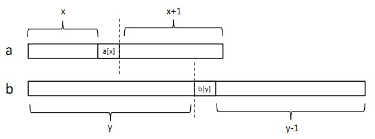
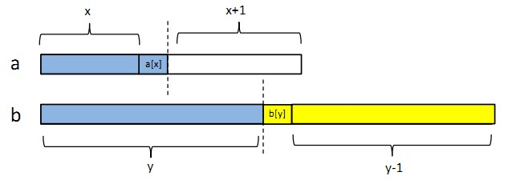
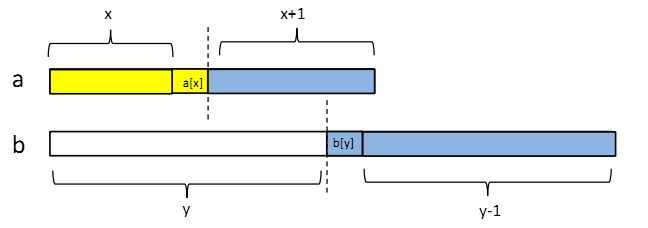
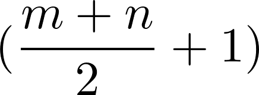
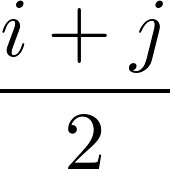
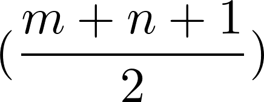
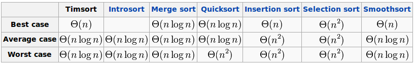

# LeetCode

[1. Two Sum `#1`](#1-two-sum-1)

[2. Add Two Numbers `#2`](#2-add-two-numbers-2)

[3. Longest Substring Without Repeating Characters `#3`](#3-longest-substring-without-repeating-characters-3)

[4. Median of Two Sorted Arrays `#4`](#4-median-of-two-sorted-arrays-4)

[5. Longest Palindromic Substring `#5`](#5-longest-palindromic-substring-5)

[6. ZigZag Conversion `#6`](#6-zigzag-conversion-6)

[7. Reverse Integer `#7`](#7-reverse-integer-7)

[8. String to Integer (atoi) `#8`](#8-string-to-integer-atoi-8)

[9. Palindrome Number `#9`](#9-palindrome-number-9)

[10. Container With Most Water `#11`](#10-container-with-most-water-11)

[11. Integer to Roman `#12`](#11-integer-to-roman-12)

[12. Roman to Integer `#13`](#12-roman-to-integer-13)

[13. Longest Common Prefix `#14`](#13-longest-common-prefix-14)

[14. 3Sum `#15`](#14-3sum-15)

[15. 3Sum Closest `#16`](#15-3sum-closest-16)

## 1. Two Sum `#1`
### Problem
Given an array of integers, return indices of the two numbers such that they add up to a specific target.

You may assume that each input would have exactly one solution, and you may not use the same element twice.

### Example
```
Given nums = [2, 7, 11, 15], target = 9,

Because nums[0] + nums[1] = 2 + 7 = 9,
return [0, 1].
```

### Solution
```python
class Solution(object):
    def twoSum(self, nums, target):
        """
        :type nums: List[int]
        :type target: int
        :rtype: List[int]
        """
        list = []
        for i in range(len(nums)):
            for j in range(i + 1, len(nums)):
                if nums[i] + nums[j] == target:
                    list.append(i)
                    list.append(j)
                    return list
```

### Note
Use hash table, maps, etc. for better running time.

May 5th, 2018

## 2. Add Two Numbers `#2`
### Problem
You are given two non-empty linked lists representing two non-negative integers. The digits are stored in reverse order and each of their nodes contain a single digit. Add the two numbers and return it as a linked list.

You may assume the two numbers do not contain any leading zero, except the number 0 itself.

### Example
```
Input: (2 -> 4 -> 3) + (5 -> 6 -> 4)
Output: 7 -> 0 -> 8
Explanation: 342 + 465 = 807.
```

### Solution
```python
# Definition for singly-linked list.
# class ListNode(object):
#    def __init__(self, x):
#        self.val = x
#        self.next = None

class Solution(object):
    def addTwoNumbers(self, l1, l2):
        """
        :type l1: ListNode
        :type l2: ListNode
        :rtype: ListNode
        """
        firstdigit = l1.val + l2.val
        if firstdigit < 10:
            head = ListNode(firstdigit)
            movepointer = head
            flag = 0
            while l1.next != None:
                if l2.next != None:
                    l1 = l1.next
                    l2 = l2.next
                    digit = l1.val + l2.val
                    if digit < 10:
                        if digit + flag < 10:
                            movepointer.next = ListNode(digit + flag)
                            movepointer = movepointer.next
                            flag = 0
                        else:
                            movepointer.next = ListNode(digit + flag - 10)
                            movepointer = movepointer.next
                            flag = 1
                            movepointer.next = ListNode(1)
                    else:
                        movepointer.next = ListNode(digit - 10 + flag)
                        movepointer = movepointer.next
                        flag = 1
                        movepointer.next = ListNode(1)
                else:
                    l1 = l1.next
                    if l1.val + flag < 10:
                        movepointer.next = ListNode(l1.val + flag)
                        movepointer = movepointer.next
                        flag = 0
                    else:
                        movepointer.next = ListNode(l1.val + flag - 10)
                        movepointer = movepointer.next
                        flag = 1
                        movepointer.next = ListNode(1)
            while l2.next != None:
                l2 = l2.next
                if l2.val + flag < 10:
                    movepointer.next = ListNode(l2.val + flag)
                    movepointer = movepointer.next
                    flag = 0
                else:
                    movepointer.next = ListNode(l2.val + flag - 10)
                    movepointer = movepointer.next
                    flag = 1
                    movepointer.next = ListNode(1)
        else:
            head = ListNode(firstdigit - 10)
            movepointer = head
            movepointer.next = ListNode(1)
            flag = 1
            while l1.next != None:
                if l2.next != None:
                    l1 = l1.next
                    l2 = l2.next
                    digit = l1.val + l2.val
                    if digit < 10:
                        if digit + flag < 10:
                            movepointer.next = ListNode(digit + flag)
                            movepointer = movepointer.next
                            flag = 0
                        else:
                            movepointer.next = ListNode(digit + flag - 10)
                            movepointer = movepointer.next
                            flag = 1
                            movepointer.next = ListNode(1)
                    else:
                        movepointer.next = ListNode(digit - 10 + flag)
                        movepointer = movepointer.next
                        flag = 1
                        movepointer.next = ListNode(1)
                else:
                    l1 = l1.next
                    if l1.val + flag < 10:
                        movepointer.next = ListNode(l1.val + flag)
                        movepointer = movepointer.next
                        flag = 0
                    else:
                        movepointer.next = ListNode(l1.val + flag - 10)
                        movepointer = movepointer.next
                        flag = 1
                        movepointer.next = ListNode(1)
            while l2.next != None:
                l2 = l2.next
                if l2.val + flag < 10:
                    movepointer.next = ListNode(l2.val + flag)
                    movepointer = movepointer.next
                    flag = 0
                else:
                    movepointer.next = ListNode(l2.val + flag - 10)
                    movepointer = movepointer.next
                    flag = 1
                    movepointer.next = ListNode(1)
        return head
```

### Note
Better Solution:

[Pseudocode](https://leetcode.com/problems/add-two-numbers/solution/):
- Initialize current node to dummy head of the returning list.
- Initialize carry to 0.
- Initialize p and q to head of l1 and l2 respectively.
- Loop through lists l1 and l2 until you reach both ends.
  - Set x to node p's value. If p has reached the end of l1, set to 0.
  - Set y to node q's value. If q has reached the end of l2, set to 0.
  - Set sum = x + y + carry.
  - Update carry = sum / 10.
  - Create a new node with the digit value of (sum mod 10) and set it to current node's next, then advance current node to next.
  - Advance both p and q.
- Check if carry = 1, if so append a new node with digit 1 to the returning list.
- Return dummy head's next node.

May 6th, 2018

## 3. Longest Substring Without Repeating Characters `#3`
### Problem
Given a string, find the length of the longest substring without repeating characters.

### Example
```
Given "abcabcbb", the answer is "abc", which the length is 3.

Given "bbbbb", the answer is "b", with the length of 1.

Given "pwwkew", the answer is "wke", with the length of 3. Note that the answer must be a substring, "pwke" is a subsequence and not a substring.
```

### Solution
1. Exceeds Runtime Limit
```python
class Solution(object):
    def lengthOfLongestSubstring(self, s):
        """
        :type s: str
        :rtype: int
        """
        substr = {}
        max_length = 0
        input_length = len(s)
        for i in range(0, input_length):
            length = 0
            if input_length - i >= max_length:
                for j in range(i, input_length):
                    if not substr.has_key(s[j]):
                        substr[s[j]] = 1
                        length += 1
                    else:
                        substr.clear()
                        break
                max_length = max(length, max_length)
            else:
                break
        return max_length
```

2. Optimized Solution
```python
class Solution(object):
    def lengthOfLongestSubstring(self, s):
        """
        :type s: str
        :rtype: int
        """
        substr = {}
        str_length = len(s)
        start = 0
        length = 0
        max_length = 0
        for i in range(str_length):
            if not substr.has_key(s[i]):
                substr[s[i]] = i
                length += 1
                max_length = max(max_length, length)
            else:
                for j in range(start, substr[s[i]] + 1):
                    del substr[s[j]]
                    start += 1
                    length -= 1
                substr[s[i]] = i
                length += 1
        return max_length
```

### Note
1. input `pwwkew`<br>
p<br>
pw<br>
pw~~w~~<br>
w<br>
w~~w~~<br>
w<br>
wk<br>
wke<br>
wke~~w~~<br>
output `length = 3`

2. input `gaaqfeqlqky`<br>
g<br>
ga<br>
~~ga~~a<br>
aq<br>
aqf<br>
aqfe<br>
~~aq~~feq<br>
feql<br>
~~feq~~lq<br>
lqk<br>
lqky<br>
output `length = 4`<br>
[Sliding Window](https://leetcode.com/problems/longest-substring-without-repeating-characters/solution/)

May 6th, 2018

## 4. Median of Two Sorted Arrays `#4`
### Problem
There are two sorted arrays nums1 and nums2 of size m and n respectively.

Find the median of the two sorted arrays. The overall run time complexity should be O(log (m+n)).

### Example
- Example 1:
```
nums1 = [1, 3]
nums2 = [2]

The median is 2.0
```

- Example 2:
```
nums1 = [1, 2]
nums2 = [3, 4]

The median is (2 + 3)/2 = 2.5
```

### Solution
```python
class Solution(object):
    def findMedianSortedArrays(self, nums1, nums2):
        """
        :type nums1: List[int]
        :type nums2: List[int]
        :rtype: float
        """
        len_a = len(nums1)
        len_b = len(nums2)
        if ((len_a + len_b) % 2) == 1: #one odd, one even
            k = (len_a + len_b + 1) / 2
            return self.find_k(k, nums1, nums2, len_a, len_b)
        else:
            k_1 = (len_a + len_b) / 2
            k_2 = (len_a + len_b) / 2 + 1
            array_1 = nums1[:]
            array_2 = nums2[:]
            i = self.find_k(k_1, nums1, nums2, len_a, len_b)
            j = self.find_k(k_2, array_1, array_2, len_a, len_b)
            return (float(i) + j) / 2

    def find_k(self, k, nums1, nums2, len_a, len_b):
        if len_a == 0:
            return nums2[k - 1]
        elif len_b == 0:
            return nums1[k - 1]
        elif (len_a % 2) == 1 and (len_b % 2) == 1: #two odd
            x = (len_a - 1) / 2
            y = (len_b - 1) / 2
            position = x + y + 1
            if nums1[x] > nums2[y]:
                array_a = nums2
                array_b = nums1
                temp = x
                x = y
                y = temp
            else:
                array_a = nums1
                array_b = nums2
            if k <= position:
                del array_b[y : len_b]
                return self.find_k(k, array_a, array_b, len(array_a), len(array_b))
            else:
                del array_a[0 : (x + 1)]
                return self.find_k(k - x - 1, array_a, array_b, len(array_a), len(array_b))
        elif (len_a % 2) == 0 and (len_b % 2) == 0: #two even
            x = len_a / 2 - 1
            y = len_b / 2
            position = x + y + 1
            if nums1[x] > nums2[y]:
                array_a = nums2
                array_b = nums1
                temp = x
                x = y
                y = temp
            else:
                array_a = nums1
                array_b = nums2
            if k <= position:
                del array_b[y : len_b]
                return self.find_k(k, array_a, array_b, len(array_a), len(array_b))
            else:
                del array_a[0 : (x + 1)]
                return self.find_k(k - x - 1, array_a, array_b, len(array_a), len(array_b))
        else:
            if k == 1:
                return min(nums1[0], nums2[0])
            else:
                if nums1[0] > nums2[0]:
                    array_a = nums2
                    array_b = nums1
                    return self.find_k(k, array_a, array_b, len(array_a), len(array_b))
                else:
                    array_a = nums1
                    array_b = nums2
                    del array_a[0]
                    return self.find_k(k - 1, array_a, array_b, len(array_a), len(array_b))
```

### Note
Extend the problem to find the k-th number of the two sorted arrays:

**Explanation**

[Reference](http://eriol.iteye.com/blog/1172098)

For instance,

```
A = [1, 2, 5, 6, 9, 12]
B = [3, 7, 8, 10, 11, 15]
A[0] = 1, B[0] = 3
```

Split each arrays into two equal-long subarrays.

```
A = [1, 2, 5 | 6, 9, 12]
B = [3, 7, 8 | 10, 11, 15]
```

Split the each array equally.

In A, the first part has **x** numbers, the second part has **m-x** numbers, A[x] is the first number in the second part. x = 3, A[x] = 6, m = 6.

Similarly, in B, the first part has **y** numbers, the second part has **n-y** numbers, B[y] is the first number in the second part. y = 3, B[y] = 10, n = 6.

If A[x] <= B[x], continue. If A[x] > B[x], we switch the arrays.

- Scenario 1<br>
In A, **x** numbers <= **A[x]**. In B, **y** numbers <= **B[y]**. And **A[x]** <= **B[y]**.<br>
Hence, there're **x + y + 1** numbers <= B[y].<br>
If **k** <= **x + y + 1**, the k-th number must be in front of **B[y]** (not including B[y]).<br>
Hence, we can discard the second part of B, which is B[y] and the numbers after B[y].

- Scenario 2<br>
In A, **m - x - 1** numbers >= **A[x]**. In B, **n - y - 1** numbers >= **B[y]**. And **A[x]** <= **B[y]**.<br>
Hence, there're (m - x - 1) + (n - y - 1) + 1 = **(m + n) - (x + y + 1)** numbers >= A[x].<br>
If **k** > **x + y + 1**, the k-th number must be after **A[x]** (not including A[x]).<br>
Hence, we can discard the first part of A, which is A[x] and the numbers before A[x].

**Boundary Problem**

[Reference](https://blog.csdn.net/lqglqglqg/article/details/48845225)

There're different situations we should consider, for instance, if the array's length is odd or even, or the array is shorter than . We need to handle the boundary problem.

- Scenario 1<br>
**both arrays' lengths are odd**<br>
Set the median of a as a[x], the median of b as b[y].<br>
<br>
The length of array a is **2x + 1**, the length of array b is **2y + 1**. Total length is **2(x + y + 1)**.
  - If k <= x + y + 1, we can discard the yellow part. Blue part below is x + y + 1. Then, we find the **k-th** number in the new arrays.<br>
  
  - If k > x + y + 1, we can discard the yellow part. Blue part below is x + y + 1. Then, we find the **(k - x - 1)-th** number in the new arrays.<br>
  
  - If a[x] > b[y], we simply switch the arrays.

- Scenario 2<br>
**both arrays' lengths are even**<br>
Set the **upper** median of a as a[x], the **lower** median of b as b[y].<br>
<br>
The length of array a is **2x + 2**, the length of array b is **2y**. Total length is **2(x + y + 1)**.
  - If k <= x + y + 1, we can discard the yellow part. Blue part below is x + y + 1. Then, we find the **k-th** number in the new arrays.<br>
  
  - If k > x + y + 1, we can discard the yellow part. Blue part below is x + y + 1. Then, we find the **(k - x - 1)-th** number in the new arrays.<br>
  
  - If a[x] > b[y], we simply switch the arrays.

- Scenario 3<br>
**one of the arrays' length is odd, the other one is even**
  - If k = 1, we return min(a[0], b[0]).
  - If k > 1, and if a[0] < b[0], a[0] would be the smallest number of the two arrays. We discard the a[0], then find the **(k - 1)-th** number in the new arrays. Array a's length will be subtracted by 1, the problem will be transformed to Scenario 1 or Scenario 2.

**Others**

Finding the median of the two sorted arrays can be treated as
1. finding the -th number as **i**, and -th number as **j**, of the two sorted arrays, then the median is , if **m + n** is even;
2. finding the -th number of the two sorted arrays, if **m + n** is odd.

**Important Stuff**
1. Need to check on finding k-th number, or (k - x - 1)-th number, or (k - 1)-th number.
2. Need to check on k and the subscript. The array starts from 0, but k starts form 1.
3. Python's variable is only a name tag. The array after inputting to the functions will be altered globally. Copy the arrays if needed. Use `copy_list = original_list[:]` to copy. Knows what it means and how to use slice operator. `:` in Python is a slice operator.
4. In Python, if you want to delete some list elements. For instance, for `a = [1, 2, 3]`, `del a[0 : 2]` will result in `a = [3]`. For `a = [1]`, `del a[0 : 1]` will result in `a = []`.
5. Return the value from recursion should be handled. It will only return to one upper layer, will not return to the top layer. We should return the value recursively, too.

May 7th, 2018

## 5. Longest Palindromic Substring `#5`
### Problem
Given a string s, find the longest palindromic substring in s. You may assume that the maximum length of s is 1000.

### Example
- Example 1:
```
Input: "babad"
Output: "bab"
Note: "aba" is also a valid answer.
```

- Example 2:
```
Input: "cbbd"
Output: "bb"
```

### Solution
1. Exceeds Runtime Limit
```python
class Solution(object):
    def longestPalindrome(self, s):
        """
        :type s: str
        :rtype: str
        """
        new_s = '\0'
        for i in range(len(s) - 1):
            new_s = new_s + s[i] + '\1'
        new_s = new_s + s[len(s) - 1] + '\0'
        length = []
        for i in range(len(new_s)):
            if new_s[i] == '\0':
                continue
            else:
                j = 1
                radius = 0
                while new_s[i - j] != '\0' and new_s[i + j] != '\0' and new_s[i - j] == new_s[i + j]:
                    if new_s[i + j] != '\1':
                        radius += 2
                    j += 1
                if new_s[i] != '\1':
                    radius += 1
                length.append(radius)
        result = []
        if (max(length) % 2) == 1:
            for i in range(max(length)):
                result.append(s[length.index(max(length)) / 2 - max(length) / 2 + i])
        else:
            for i in range(max(length)):
                result.append(s[(length.index(max(length)) + 1) / 2 - max(length) / 2 + i])
        result_str = ''.join(result)
        return result_str
```

2. Optimized Solution
```python
class Solution(object):
    def longestPalindrome(self, s):
        """
        :type s: str
        :rtype: str
        """
        new_s = '\0'
        for i in range(len(s) - 1):
            new_s = new_s + s[i] + '\1'
        new_s = new_s + s[len(s) - 1] + '\0'
        length = []
        for i in range(len(new_s)):
            if new_s[i] == '\0':
                continue
            else:
                j = 1
                radius = 0
                while new_s[i - j] != '\0' and new_s[i + j] != '\0' and new_s[i - j] == new_s[i + j]:
                    if new_s[i + j] != '\1':
                        radius += 2
                    j += 1
                if new_s[i] != '\1':
                    radius += 1
                length.append(radius)
                if radius == len(s):
                    break
        result = []
        if (max(length) % 2) == 1:
            for i in range(max(length)):
                result.append(s[length.index(max(length)) / 2 - max(length) / 2 + i])
        else:
            for i in range(max(length)):
                result.append(s[(length.index(max(length)) + 1) / 2 - max(length) / 2 + i])
        result_str = ''.join(result)
        return result_str
```

### Note
1.
  - Handle the Original String<br>
  Example:<br>
  Original String: babad<br>
  After Handled: $b#a#b#a#d$<br>
  In Solution 1, I used '\0' to be '$' and '\1' to be '#' in order to avoid the situation that if the original string have the character '$' or '#'.<br>
  After handling the string, we don't need to check about whether the palindromic string is odd or even.
  - When hitting '\0' ('$'), means it reaches to the edge, stop.
  - Record the length of the palindromic by adding 2 when having the same character in both of the side.<br>
  If having '\1' ('#') in both of the side, do not add numbers.<br>
  In the end, check the middle point. If the middle point is not '\1' ('#'), add 1.<br>
  It will have the length of the palindromic string in the original string.<br>
  ```
  b a b a d
  $ b # a # b # a # d $
  - 1 0 3 0 3 0 1 0 1 -
  Maximum = 3
  ```
  ```python
  length = [1, 0, 3, 0, 3, 0, 1, 0, 1]
  # output
  max(length) = 3
  length.index(max(length)) = 2
  ```
  - We know that the maximum palindromic length is 3. Then we append the characters in the original string to a new list.
  - After we have the result list, we have to transform the list to string.<br>
  ```python
  # result is a list, result_str is a string.
  result_str = ''.join(result)
  # output
  result = [u'b', u'a', u'b']
  result_str = 'bab'
  ```
  - In Python, Strings cannot be altered, but Lists can.

2.
  - Only adding one if statement.<br>
  If the length of the palindromic string is as long as the original string. That would be the longest palindromic string, we don't need to check the remaining characters.
  ```python
  if radius == len(s):
      break
  ```
  ```
  aaa
  We checked to the second 'a', we found that the length of the palindromic string centered in the second 'a' is 3, we stop the checking. Because it must be the longest one.
  ```

3.
  &ensp;&ensp;The best solution is Manacher's Algorithm. It only takes liner time. O(n)<br>
  &ensp;&ensp;My solution is O(n<sup>2</sup>).<br>
  &ensp;&ensp;Use KMP Algorithm may take O(nlogn).

May 9th, 2018

## 6. ZigZag Conversion `#6`
### Problem
The string "PAYPALISHIRING" is written in a zigzag pattern on a given number of rows like this: (you may want to display this pattern in a fixed font for better legibility)
```
P   A   H   N
A P L S I I G
Y   I   R
```
And then read line by line: "PAHNAPLSIIGYIR"

Write the code that will take a string and make this conversion given a number of rows:
```
string convert(string s, int numRows);
```

### Example
- Example 1:
```
Input: s = "PAYPALISHIRING", numRows = 3
Output: "PAHNAPLSIIGYIR"
```

- Example 2:
```
Input: s = "PAYPALISHIRING", numRows = 4
Output: "PINALSIGYAHRPI"
Explanation:

P     I    N
A   L S  I G
Y A   H R
P     I
```

### Solution
```python
class Solution(object):
    def convert(self, s, numRows):
        """
        :type s: str
        :type numRows: int
        :rtype: str
        """
        rows = []
        if numRows == 1:
            return s
        else:
            for i in range(numRows):
                rows.append([])
            for i in range(len(s)):
                position = i % (2 * numRows - 2)
                if position <= numRows - 1:
                    rows[position].append(s[i])
                else:
                    rows[(numRows - 1) - (position % numRows + 1)].append(s[i])
            result_str = ''
            for i in range(numRows):
                result_str = result_str + ''.join(rows[i])
            return result_str
```

### Note
1. Find the pattern. Read the problem carefully. It's given the zigzag string and output the line by line string. Not the other way around.

2. Use mod operation to determine the index of the list.

3. For instance,
```
0     6       12
1   5 7    11 13
2 4   8 10    14
3     9

0
1   5
2 4
3

It is a loop of the first 5 digits in numRows = 4.
It is a loop for 2 * numRows - 2 digits.
```

4. We build 4 lists for numRows = 4.

5. For 0-3, which are < numRows. I insert the character to its according list.<br>
For 4-5, which are >= numRows. I insert the character to its according list by reverse order.

6. In the end, I join all lists together and transform it to be a string.

May 9th, 2018

## 7. Reverse Integer `#7`
### Problem
Given a 32-bit signed integer, reverse digits of an integer.

**Note:**

Assume we are dealing with an environment which could only store integers within the 32-bit signed integer range: [−2<sup>31</sup>,  2<sup>31</sup> − 1]. For the purpose of this problem, assume that your function returns 0 when the reversed integer overflows.

### Example
- Example 1:
```
Input: 123
Output: 321
```

- Example 2:
```
Input: -123
Output: -321
```

- Example 3:
```
Input: 120
Output: 21
```

### Solution
```python
class Solution(object):
    def reverse(self, x):
        """
        :type x: int
        :rtype: int
        """
        input = str(x)
        length = len(input)
        result_list = []
        result_str = ''
        if input[0] != '-':
            if input[0] == '0':
                return 0
            if input[length - 1] != '0':
                for i in range(length - 1, -1, -1):
                    result_list.append(input[i])
            else:
                for i in range(length - 2, -1, -1):
                    result_list.append(input[i])
        else:
            if input[length - 1] != '0':
                for i in range(length - 1, 0, -1):
                    result_list.append(input[i])
                result_list.insert(0, '-')
            else:
                for i in range(length - 2, 0, -1):
                    result_list.append(input[i])
                result_list.insert(0, '-')
        result_str = ''.join(result_list)
        result_int = int(result_str)
        if result_int >= -(2**31) and result_int < 2**31:
            return result_int
        else:
            return 0
```

### Note
1. The problem assumes that the int range is [-2<sup>31</sup>, 2<sup>31</sup> -1]. For the reversed integer overflows, we should return 0.

2. We should return 0 when input 0.

3. In Python, the integer range is much more flexible than in C++, therefore, we should manually check the reversed integer.

May 10th, 2018

## 8. String to Integer (atoi) `#8`
### Problem
Implement `atoi` which converts a string to an integer.

The function first discards as many whitespace characters as necessary until the first non-whitespace character is found. Then, starting from this character, takes an optional initial plus or minus sign followed by as many numerical digits as possible, and interprets them as a numerical value.

The string can contain additional characters after those that form the integral number, which are ignored and have no effect on the behavior of this function.

If the first sequence of non-whitespace characters in str is not a valid integral number, or if no such sequence exists because either str is empty or it contains only whitespace characters, no conversion is performed.

If no valid conversion could be performed, a zero value is returned.

**Note:**

- Only the space character `' '` is considered as whitespace character.
- Assume we are dealing with an environment which could only store integers within the 32-bit signed integer range: [−2<sup>31</sup>,  2<sup>31</sup> − 1]. If the numerical value is out of the range of representable values, INT_MAX (2<sup>31</sup> − 1) or INT_MIN (−2<sup>31</sup>) is returned.

### Example
- Example 1:
```
Input: "42"
Output: 42
```

- Example 2:
```
Input: "   -42"
Output: -42
Explanation: The first non-whitespace character is '-', which is the minus sign.
             Then take as many numerical digits as possible, which gets 42.
```

- Example 3:
```
Input: "4193 with words"
Output: 4193
Explanation: Conversion stops at digit '3' as the next character is not a numerical digit.
```

- Example 4:
```
Input: "words and 987"
Output: 0
Explanation: The first non-whitespace character is 'w', which is not a numerical
             digit or a +/- sign. Therefore no valid conversion could be performed.
```

- Example 5:
```
Input: "-91283472332"
Output: -2147483648
Explanation: The number "-91283472332" is out of the range of a 32-bit signed integer.
             Therefore INT_MIN (−2^31) is returned.
```

### Solution
```python
class Solution(object):
    def myAtoi(self, str):
        """
        :type str: str
        :rtype: int
        """
        i = 0
        if len(str) == 0:
            return 0
        while i < len(str) and str[i] == ' ':
            i += 1
        if i == len(str):
            return 0
        first = self.checkDigit(str[i])
        digitList = []
        if first == False:
            return 0
        else:
            j = 0
            if first == True:
                while (i + j) < len(str) and self.checkDigit(str[i + j]) == True:
                    digitList.append(str[i + j])
                    j += 1
            else:
                if i == len(str) - 1:
                    return 0
                if self.checkDigit(str[i + 1]) == True:
                    while (i + j + 1) < len(str) and self.checkDigit(str[i + j + 1]) == True:
                        digitList.append(str[i + j + 1])
                        j += 1
                else:
                    return 0
            result = 0
            if digitList[0] == '0':
                j -= 1
                for k in range(1, j + 1):
                    digit = self.convertStr(digitList[k])
                    result = result + digit * (10 ** (j - k))
                if first == 'minus':
                    result = result * (-1)
                return self.resultRange(result)
            else:
                for k in range(0, j):
                    digit = self.convertStr(digitList[k])
                    result = result + digit * (10 ** (j - k - 1))
                if first == 'minus':
                    result = result * (-1)
                return self.resultRange(result)

    def checkDigit(self, character):
        if (character == '0' or character ==  '1' or character == '2'
            or character == '3' or character == '4' or character == '5'
            or character == '6' or character == '7' or character == '8'
            or character == '9'):
            return True
        elif character == '+':
            return 'plus'
        elif character == '-':
            return 'minus'
        else:
            return False

    def convertStr(self, character):
        if character == '1':
            return 1
        elif character == '2':
            return 2
        elif character == '3':
            return 3
        elif character == '4':
            return 4
        elif character == '5':
            return 5
        elif character == '6':
            return 6
        elif character == '7':
            return 7
        elif character == '8':
            return 8
        elif character == '9':
            return 9
        else:
            return 0

    def resultRange(self, number):
        smallest = -(2**31)
        greatest = 2**31 - 1
        if number < smallest:
            return smallest
        elif number > greatest:
            return greatest
        else:
            return number
```

### Note
1. Read the question carefully and consider all situations.

2. Return something can mean `True` in Python.

May 11th, 2018

## 9. Palindrome Number `#9`
### Problem
Determine whether an integer is a palindrome. An integer is a palindrome when it reads the same backward as forward.

**Follow up:**

Coud you solve it without converting the integer to a string?

### Example
- Example 1:
```
Input: 121
Output: true
```

- Example 2:
```
Input: -121
Output: false
Explanation: From left to right, it reads -121. From right to left, it becomes 121-. Therefore it is not a palindrome.
```

- Example 3:
```
Input: 10
Output: false
Explanation: Reads 01 from right to left. Therefore it is not a palindrome.
```

### Solution
```python
from math import log10
class Solution(object):
    def isPalindrome(self, x):
        """
        :type x: int
        :rtype: bool
        """
        if x < 0:
            return False
        elif x < 10:
            return True
        else:
            digits = int(log10(x) + 1)
            if digits % 2 == 0:
                j = digits / 2
                for i in range(j):
                    if (x / (10 ** (j + i)) % 10) == (x / (10 ** (j - i - 1)) % 10):
                        continue
                    else:
                        return False
                return True
            else:
                j = (digits - 1) / 2
                for i in range(j):
                    if (x / (10 ** (j + i + 1)) % 10) == (x / (10 ** (j - i - 1)) % 10):
                        continue
                    else:
                        return False
                return True
```

### Note
1. Use log10 function to get how many digits in a number for number > 0.<br>
```python
from math import log10
digits = int(log10(x) + 1)
```
2. For instance:<br>
`number = 123456`<br>
  - 1<sup>st</sup> digit: 123456 / 10<sup>0</sup> % 10 = 6
  - 2<sup>nd</sup> digit: 123456 / 10<sup>1</sup> % 10 = 5
  - 3<sup>rd</sup> digit: 123456 / 10<sup>2</sup> % 10 = 4
  - 4<sup>th</sup> digit: 123456 / 10<sup>3</sup> % 10 = 3
  - 5<sup>th</sup> digit: 123456 / 10<sup>4</sup> % 10 = 2
  - 6<sup>th</sup> digit: 123456 / 10<sup>5</sup> % 10 = 1

May 12th, 2018

## 10. Container With Most Water `#11`
### Problem
Given n non-negative integers a<sub>1</sub>, a<sub>2</sub>, ..., a<sub>n</sub>, where each represents a point at coordinate (i, a<sub>i</sub>). n vertical lines are drawn such that the two endpoints of line i is at (i, a<sub>i</sub>) and (i, 0). Find two lines, which together with x-axis forms a container, such that the container contains the most water.

Note: You may not slant the container and n is at least 2.

### Solution
```python
class Solution(object):
    def maxArea(self, height):
        """
        :type height: List[int]
        :rtype: int
        """
        result = 0
        start = 0
        end = len(height) - 1
        while start != end:
            result = max(result, min(height[start], height[end]) * (end - start))
            if height[start] <= height[end]:
                start += 1
            else:
                end -= 1
        return result
```

### Note

[Video 1](https://www.youtube.com/watch?v=IONgE6QZgGI)

[Video 2](https://www.bilibili.com/video/av16708819)

May 14th, 2018

## 11. Integer to Roman `#12`
### Problem
Roman numerals are represented by seven different symbols: I, V, X, L, C, D and M.

```
Symbol       Value
I             1
V             5
X             10
L             50
C             100
D             500
M             1000
```

For example, two is written as II in Roman numeral, just two one's added together. Twelve is written as, XII, which is simply X + II. The number twenty seven is written as XXVII, which is XX + V + II.

Roman numerals are usually written largest to smallest from left to right. However, the numeral for four is not IIII. Instead, the number four is written as IV. Because the one is before the five we subtract it making four. The same principle applies to the number nine, which is written as IX. There are six instances where subtraction is used:
- I can be placed before V (5) and X (10) to make 4 and 9.
- X can be placed before L (50) and C (100) to make 40 and 90.
- C can be placed before D (500) and M (1000) to make 400 and 900.

Given an integer, convert it to a roman numeral. Input is guaranteed to be within the range from 1 to 3999.

### Example
- Example 1:
```
Input: 3
Output: "III"
```

- Example 2:
```
Input: 4
Output: "IV"
```

- Example 3:
```
Input: 9
Output: "IX"
```

- Example 4:
```
Input: 58
Output: "LVIII"
Explanation: C = 100, L = 50, XXX = 30 and III = 3.
```

- Example 5:
```
Input: 1994
Output: "MCMXCIV"
Explanation: M = 1000, CM = 900, XC = 90 and IV = 4.
```

### Solution
```python
from math import log10
class Solution(object):
    def intToRoman(self, num):
        """
        :type num: int
        :rtype: str
        """
        digits = int(log10(num) + 1)
        result = []
        for i in range(digits):
            number = num / (10 ** i) % 10
            if i == 0:
                if number > 0 and number < 4:
                    for j in range(number):
                        result.insert(0, 'I')
                elif number == 4:
                    result.insert(0, 'V')
                    result.insert(0, 'I')
                elif number >= 5 and number < 9:
                    for j in range(number - 5):
                        result.insert(0, 'I')
                    result.insert(0, 'V')
                elif number == 9:
                    result.insert(0, 'X')
                    result.insert(0, 'I')
            if i == 1:
                if number > 0 and number < 4:
                    for j in range(number):
                        result.insert(0, 'X')
                elif number == 4:
                    result.insert(0, 'L')
                    result.insert(0, 'X')
                elif number >= 5 and number < 9:
                    for j in range(number - 5):
                        result.insert(0, 'X')
                    result.insert(0, 'L')
                elif number == 9:
                    result.insert(0, 'C')
                    result.insert(0, 'X')
            if i == 2:
                if number > 0 and number < 4:
                    for j in range(number):
                        result.insert(0, 'C')
                elif number == 4:
                    result.insert(0, 'D')
                    result.insert(0, 'C')
                elif number >= 5 and number < 9:
                    for j in range(number - 5):
                        result.insert(0, 'C')
                    result.insert(0, 'D')
                elif number == 9:
                    result.insert(0, 'M')
                    result.insert(0, 'C')
            if i == 3:
                for j in range(number):
                    result.insert(0, 'M')
        result_str = ''.join(result)
        return result_str
```

### Note
1. Use `log10` function to calculate the digits of the number.
```python
from math import log10
digits = int(log10(num) + 1)
```

2. Get the number in each digit.
```python
for i in range(len(num)):
    number = num / (10 ** i) % 10
```

May 14th, 2018

## 12. Roman to Integer `#13`
### Problem
Roman numerals are represented by seven different symbols: I, V, X, L, C, D and M.

```
Symbol       Value
I             1
V             5
X             10
L             50
C             100
D             500
M             1000
```
For example, two is written as II in Roman numeral, just two one's added together. Twelve is written as, XII, which is simply X + II. The number twenty seven is written as XXVII, which is XX + V + II.

Roman numerals are usually written largest to smallest from left to right. However, the numeral for four is not IIII. Instead, the number four is written as IV. Because the one is before the five we subtract it making four. The same principle applies to the number nine, which is written as IX. There are six instances where subtraction is used:
- I can be placed before V (5) and X (10) to make 4 and 9.
- X can be placed before L (50) and C (100) to make 40 and 90.
- C can be placed before D (500) and M (1000) to make 400 and 900.

Given a roman numeral, convert it to an integer. Input is guaranteed to be within the range from 1 to 3999.

### Example
- Example 1:
```
Input: "III"
Output: 3
```

- Example 2:
```
Input: "IV"
Output: 4
```

- Example 3:
```
Input: "IX"
Output: 9
```

- Example 4:
```
Input: "LVIII"
Output: 58
Explanation: C = 100, L = 50, XXX = 30 and III = 3.
```

- Example 5:
```
Input: "MCMXCIV"
Output: 1994
Explanation: M = 1000, CM = 900, XC = 90 and IV = 4.
```

### Solution
```python
class Solution(object):
    def romanToInt(self, s):
        """
        :type s: str
        :rtype: int
        """
        result = 0
        for i in range(len(s)):
            if s[i] == 'M':
                result += 1000
            elif s[i] == 'D':
                result += 500
            elif s[i] == 'C':
                if i + 1 < len(s):
                    if s[i + 1] == 'M' or s[i + 1] == 'D':
                        result -= 100
                    else:
                        result += 100
                else:
                    result += 100
            elif s[i] == 'L':
                result += 50
            elif s[i] == 'X':
                if i + 1 < len(s):
                    if s[i + 1] == 'C' or s[i + 1] == 'L':
                        result -= 10
                    else:
                        result += 10
                else:
                    result += 10
            elif s[i] == 'V':
                result += 5
            elif s[i] == 'I':
                if i + 1 < len(s):
                    if s[i + 1] == 'X' or s[i + 1] == 'V':
                        result -= 1
                    else:
                        result += 1
                else:
                    result += 1
        return result
```

### Note
Be careful of the subtraction situations.
```
I can be placed before V (5) and X (10) to make 4 and 9.
X can be placed before L (50) and C (100) to make 40 and 90.
C can be placed before D (500) and M (1000) to make 400 and 900.
```

May 15th, 2018

## 13. Longest Common Prefix `#14`
### Problem
Write a function to find the longest common prefix string amongst an array of strings.

If there is no common prefix, return an empty string "".

**Note:**

All given inputs are in lowercase letters a-z.

### Example
- Example 1:
```
Input: ["flower","flow","flight"]
Output: "fl"
```

- Example 2:
```
Input: ["dog","racecar","car"]
Output: ""
Explanation: There is no common prefix among the input strings.
```

### Solution
```python
class Solution(object):
    def longestCommonPrefix(self, strs):
        """
        :type strs: List[str]
        :rtype: str
        """
        result = []
        if len(strs) == 0:
            return ''
        elif len(strs) == 1:
            return strs[0]
        else:
            for i in range(len(strs[0])):
                character = strs[0][i]
                count = 1
                for j in range(1, len(strs)):
                    try:
                        if strs[j][i] == character:
                            count += 1
                        else:
                            break
                    except:
                        break
                if count == len(strs):
                    result.append(character)
                else:
                    break
            result_str = ''.join(result)
            return result_str
```

### Note
Use try-except to handle getting strings ends.

May 15th, 2018

## 14. 3Sum `#15`
### Problem
Given an array nums of n integers, are there elements a, b, c in nums such that a + b + c = 0? Find all unique triplets in the array which gives the sum of zero.

**Note:**

The solution set must not contain duplicate triplets.

### Example
```
Given array nums = [-1, 0, 1, 2, -1, -4],

A solution set is:
[
  [-1, 0, 1],
  [-1, -1, 2]
]
```

### Solution
1. Exceeds Runtime Limit
```python
class Solution(object):
    def threeSum(self, nums):
        """
        :type nums: List[int]
        :rtype: List[List[int]]
        """
        nums_sorted = self.mergesort(nums)
        result_pairs = []
        j = 0
        for i in range(len(nums_sorted) - 2):
            start = 1
            end = 1
            if nums_sorted[i] > 0:
                break
            else:
                if i > 0:
                    if nums_sorted[i] == nums_sorted[i - 1]:
                        continue
                while (i + start) < (len(nums_sorted) - end):
                    if (nums_sorted[i + start] + nums_sorted[len(nums_sorted) - end]) > (nums_sorted[i] * (-1)):
                        end += 1
                    elif (nums_sorted[i + start] + nums_sorted[len(nums_sorted) - end]) < (nums_sorted[i] * (-1)):
                        start += 1
                    else:
                        if j > 0:
                            if nums_sorted[i + start] == result_pairs[j - 1][1] and nums_sorted[len(nums_sorted) - end] == result_pairs[j - 1][2]:
                                end += 1
                                start += 1
                            else:
                                result_pairs.append([])
                                result_pairs[j].append(nums_sorted[i])
                                result_pairs[j].append(nums_sorted[i + start])
                                result_pairs[j].append(nums_sorted[len(nums_sorted) - end])
                                j += 1
                                end += 1
                                start += 1
                        else:
                            result_pairs.append([])
                            result_pairs[j].append(nums_sorted[i])
                            result_pairs[j].append(nums_sorted[i + start])
                            result_pairs[j].append(nums_sorted[len(nums_sorted) - end])
                            j += 1
                            end += 1
                            start += 1
        return result_pairs

    def mergesort(self, seq):  
        if len(seq)<= 1:  
            return seq  
        mid = int(len(seq) / 2)  
        left = self.mergesort(seq[ : mid])  
        right = self.mergesort(seq[mid : ])  
        return self.merge(left, right)  

    def merge(self, left,right):  
        result = []  
        i, j = 0, 0  
        while i < len(left) and j < len(right):  
            if left[i] <= right[j]:  
                result.append(left[i])  
                i += 1  
            else:  
                result.append(right[j])  
                j += 1  
        result += left[i : ]  
        result += right[j : ]  
        return result
```

2. Optimized Solution
```python
class Solution(object):
    def threeSum(self, nums):
        """
        :type nums: List[int]
        :rtype: List[List[int]]
        """
        nums.sort()
        result_pairs = []
        j = 0
        for i in range(len(nums) - 2):
            start = 1
            end = 1
            if nums[i] > 0:
                break
            elif i > 0 and nums[i] == nums[i - 1]:
                continue
            else:
                while (i + start) < (len(nums) - end):
                    if (nums[i + start] + nums[len(nums) - end]) > (nums[i] * (-1)):
                        end += 1
                    elif (nums[i + start] + nums[len(nums) - end]) < (nums[i] * (-1)):
                        start += 1
                    else:
                        if j > 0:
                            if nums[i + start] == result_pairs[j - 1][1] and nums[len(nums) - end] == result_pairs[j - 1][2]:
                                end += 1
                                start += 1
                                continue
                        result_pairs.append([])
                        result_pairs[j].append(nums[i])
                        result_pairs[j].append(nums[i + start])
                        result_pairs[j].append(nums[len(nums) - end])
                        j += 1
                        end += 1
                        start += 1
        return result_pairs
```

### Note
Use Python's `sort()` function to sort the list can be faster.



Python's `sort()` uses Timsort, it is better than merge sort in real-world data.

May 16th, 2018

## 15. 3Sum Closest `#16`
### Problem
Given an array nums of n integers and an integer target, find three integers in nums such that the sum is closest to target. Return the sum of the three integers. You may assume that each input would have exactly one solution.

### Example
```
Given array nums = [-1, 2, 1, -4], and target = 1.

The sum that is closest to the target is 2. (-1 + 2 + 1 = 2).
```

### Solution
```python
class Solution(object):
    def threeSumClosest(self, nums, target):
        """
        :type nums: List[int]
        :type target: int
        :rtype: int
        """
        nums.sort()
        for i in range(len(nums) - 2):
            start = 1
            end = 1
            while i + start < len(nums) - end:
                if (nums[i + start] + nums[len(nums) - end]) < (target - nums[i]):
                    if i == 0 and start == 1 and end == 1:
                        record_i = 0
                        record_start = start
                        record_end = end
                        record_gap = abs(target - (nums[i] + nums[i + start] + nums[len(nums) - end]))
                    else:
                        if abs((target - (nums[i] + nums[i + start] + nums[len(nums) - end]))) < record_gap:
                            record_i = i
                            record_start = start
                            record_end = end
                            record_gap = abs((target - (nums[i] + nums[i + start] + nums[len(nums) - end])))
                    start += 1
                elif (nums[i + start] + nums[len(nums) - end]) > (target - nums[i]):
                    if i == 0 and start == 1 and end == 1:
                        record_i = 0
                        record_start = start
                        record_end = end
                        record_gap = abs(target - (nums[i] + nums[i + start] + nums[len(nums) - end]))
                    else:
                        if abs((target - (nums[i] + nums[i + start] + nums[len(nums) - end]))) < record_gap:
                            record_i = i
                            record_start = start
                            record_end = end
                            record_gap = abs((target - (nums[i] + nums[i + start] + nums[len(nums) - end])))
                    end += 1
                else:
                    return target
        return nums[record_i] + nums[record_i + record_start] + nums[len(nums) - record_end]
```

### Note
Similar to [3Sum `#15`](#14-3sum-15)

May 16th, 2018
