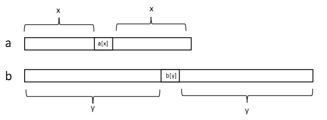
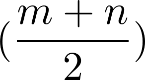

# LeetCode

[1. Two Sum `#1`](#1-two-sum-1)

[2. Add Two Numbers `#2`](#2-add-two-numbers-2)

[3. Longest Substring Without Repeating Characters `#3`](#3-longest-substring-without-repeating-characters-3)

[4. Median of Two Sorted Arrays `#4`](#4-median-of-two-sorted-arrays-4)

## 1. Two Sum `#1`
### Problem
Given an array of integers, return indices of the two numbers such that they add up to a specific target.

You may assume that each input would have exactly one solution, and you may not use the same element twice.

### Example
```
Given nums = [2, 7, 11, 15], target = 9,

Because nums[0] + nums[1] = 2 + 7 = 9,
return [0, 1].
```

### Solution
```python
class Solution(object):
    def twoSum(self, nums, target):
        """
        :type nums: List[int]
        :type target: int
        :rtype: List[int]
        """
        list = []
        for i in range(len(nums)):
            for j in range(i + 1, len(nums)):
                if nums[i] + nums[j] == target:
                    list.append(i)
                    list.append(j)
                    return list
```

### Note
Use hash table, maps, etc. for better running time.

May 5th, 2018

## 2. Add Two Numbers `#2`
### Problem
You are given two non-empty linked lists representing two non-negative integers. The digits are stored in reverse order and each of their nodes contain a single digit. Add the two numbers and return it as a linked list.

You may assume the two numbers do not contain any leading zero, except the number 0 itself.

### Example
```
Input: (2 -> 4 -> 3) + (5 -> 6 -> 4)
Output: 7 -> 0 -> 8
Explanation: 342 + 465 = 807.
```

### Solution
```python
# Definition for singly-linked list.
# class ListNode(object):
#    def __init__(self, x):
#        self.val = x
#        self.next = None

class Solution(object):
    def addTwoNumbers(self, l1, l2):
        """
        :type l1: ListNode
        :type l2: ListNode
        :rtype: ListNode
        """
        firstdigit = l1.val + l2.val
        if firstdigit < 10:
            head = ListNode(firstdigit)
            movepointer = head
            flag = 0
            while l1.next != None:
                if l2.next != None:
                    l1 = l1.next
                    l2 = l2.next
                    digit = l1.val + l2.val
                    if digit < 10:
                        if digit + flag < 10:
                            movepointer.next = ListNode(digit + flag)
                            movepointer = movepointer.next
                            flag = 0
                        else:
                            movepointer.next = ListNode(digit + flag - 10)
                            movepointer = movepointer.next
                            flag = 1
                            movepointer.next = ListNode(1)
                    else:
                        movepointer.next = ListNode(digit - 10 + flag)
                        movepointer = movepointer.next
                        flag = 1
                        movepointer.next = ListNode(1)
                else:
                    l1 = l1.next
                    if l1.val + flag < 10:
                        movepointer.next = ListNode(l1.val + flag)
                        movepointer = movepointer.next
                        flag = 0
                    else:
                        movepointer.next = ListNode(l1.val + flag - 10)
                        movepointer = movepointer.next
                        flag = 1
                        movepointer.next = ListNode(1)
            while l2.next != None:
                l2 = l2.next
                if l2.val + flag < 10:
                    movepointer.next = ListNode(l2.val + flag)
                    movepointer = movepointer.next
                    flag = 0
                else:
                    movepointer.next = ListNode(l2.val + flag - 10)
                    movepointer = movepointer.next
                    flag = 1
                    movepointer.next = ListNode(1)
        else:
            head = ListNode(firstdigit - 10)
            movepointer = head
            movepointer.next = ListNode(1)
            flag = 1
            while l1.next != None:
                if l2.next != None:
                    l1 = l1.next
                    l2 = l2.next
                    digit = l1.val + l2.val
                    if digit < 10:
                        if digit + flag < 10:
                            movepointer.next = ListNode(digit + flag)
                            movepointer = movepointer.next
                            flag = 0
                        else:
                            movepointer.next = ListNode(digit + flag - 10)
                            movepointer = movepointer.next
                            flag = 1
                            movepointer.next = ListNode(1)
                    else:
                        movepointer.next = ListNode(digit - 10 + flag)
                        movepointer = movepointer.next
                        flag = 1
                        movepointer.next = ListNode(1)
                else:
                    l1 = l1.next
                    if l1.val + flag < 10:
                        movepointer.next = ListNode(l1.val + flag)
                        movepointer = movepointer.next
                        flag = 0
                    else:
                        movepointer.next = ListNode(l1.val + flag - 10)
                        movepointer = movepointer.next
                        flag = 1
                        movepointer.next = ListNode(1)
            while l2.next != None:
                l2 = l2.next
                if l2.val + flag < 10:
                    movepointer.next = ListNode(l2.val + flag)
                    movepointer = movepointer.next
                    flag = 0
                else:
                    movepointer.next = ListNode(l2.val + flag - 10)
                    movepointer = movepointer.next
                    flag = 1
                    movepointer.next = ListNode(1)
        return head
```

### Note
Better Solution:

[Pseudocode](https://leetcode.com/problems/add-two-numbers/solution/):
- Initialize current node to dummy head of the returning list.
- Initialize carry to 0.
- Initialize p and q to head of l1 and l2 respectively.
- Loop through lists l1 and l2 until you reach both ends.
  - Set x to node p's value. If p has reached the end of l1, set to 0.
  - Set y to node q's value. If q has reached the end of l2, set to 0.
  - Set sum = x + y + carry.
  - Update carry = sum / 10.
  - Create a new node with the digit value of (sum mod 10) and set it to current node's next, then advance current node to next.
  - Advance both p and q.
- Check if carry = 1, if so append a new node with digit 1 to the returning list.
- Return dummy head's next node.

May 6th, 2018

## 3. Longest Substring Without Repeating Characters `#3`
### Problem
Given a string, find the length of the longest substring without repeating characters.

### Example
```
Given "abcabcbb", the answer is "abc", which the length is 3.

Given "bbbbb", the answer is "b", with the length of 1.

Given "pwwkew", the answer is "wke", with the length of 3. Note that the answer must be a substring, "pwke" is a subsequence and not a substring.
```

### Solution
1. Exceeds Runtime Limit
```python
class Solution(object):
    def lengthOfLongestSubstring(self, s):
        """
        :type s: str
        :rtype: int
        """
        substr = {}
        max_length = 0
        input_length = len(s)
        for i in range(0, input_length):
            length = 0
            if input_length - i >= max_length:
                for j in range(i, input_length):
                    if not substr.has_key(s[j]):
                        substr[s[j]] = 1
                        length += 1
                    else:
                        substr.clear()
                        break
                max_length = max(length, max_length)
            else:
                break
        return max_length
```

2. Optimized Solution
```python
class Solution(object):
    def lengthOfLongestSubstring(self, s):
        """
        :type s: str
        :rtype: int
        """
        substr = {}
        str_length = len(s)
        start = 0
        length = 0
        max_length = 0
        for i in range(str_length):
            if not substr.has_key(s[i]):
                substr[s[i]] = i
                length += 1
                max_length = max(max_length, length)
            else:
                for j in range(start, substr[s[i]] + 1):
                    del substr[s[j]]
                    start += 1
                    length -= 1
                substr[s[i]] = i
                length += 1
        return max_length
```

### Note
1. input `pwwkew`<br>
p<br>
pw<br>
pw~~w~~<br>
w<br>
w~~w~~<br>
w<br>
wk<br>
wke<br>
wke~~w~~<br>
output `length = 3`

2. input `gaaqfeqlqky`<br>
g<br>
ga<br>
~~ga~~a<br>
aq<br>
aqf<br>
aqfe<br>
~~aq~~feq<br>
feql<br>
~~feq~~lq<br>
lqk<br>
lqky<br>
output `length = 4`<br>
[Sliding Window](https://leetcode.com/problems/longest-substring-without-repeating-characters/solution/)

May 6th, 2018

## 4. Median of Two Sorted Arrays `#4`
### Problem
There are two sorted arrays nums1 and nums2 of size m and n respectively.

Find the median of the two sorted arrays. The overall run time complexity should be O(log (m+n)).

### Example
- Example 1:
```
nums1 = [1, 3]
nums2 = [2]

The median is 2.0
```

- Example 2:
```
nums1 = [1, 2]
nums2 = [3, 4]

The median is (2 + 3)/2 = 2.5
```

### Solution
```python

```

### Note
Extend the problem to find the k-th number of the two sorted arrays:

**Explanation**

[Reference](http://eriol.iteye.com/blog/1172098)

For instance,

```
A = [1, 2, 5, 6, 9, 12]
B = [3, 7, 8, 10, 11, 15]
A[0] = 1, B[0] = 3
```

Split each arrays into two equal-long subarrays.

```
A = [1, 2, 5 | 6, 9, 12]
B = [3, 7, 8 | 10, 11, 15]
```

Split the each array equally.

In A, the first part has **x** numbers, the second part has **m-x** numbers, A[x] is the first number in the second part. x = 3, A[x] = 6, m = 6.

Similarly, in B, the first part has **y** numbers, the second part has **n-y** numbers, B[y] is the first number in the second part. y = 3, B[y] = 10, n = 6.

If A[x] <= B[x], continue. If A[x] > B[x], we switch the arrays.

- Scenario 1<br>
In A, **x** numbers <= **A[x]**. In B, **y** numbers <= **B[y]**. And **A[x]** <= **B[y]**.<br>
Hence, there're **x + y + 1** numbers <= B[y].<br>
If **k** <= **x + y + 1**, the k-th number must be in front of **B[y]** (not including B[y]).<br>
Hence, we can discard the second part of B, which is B[y] and the numbers after B[y].

- Scenario 2<br>
In A, **m - x - 1** numbers >= **A[x]**. In B, **n - y - 1** numbers >= **B[y]**. And **A[x]** <= **B[y]**.<br>
Hence, there're (m - x - 1) + (n - y - 1) + 1 = **(m + n) - (x + y + 1)** numbers >= A[x].<br>
If **k** > **x + y + 1**, the k-th number must be after **A[x]** (not including A[x]).<br>
Hence, we can discard the first part of A, which is A[x] and the numbers before A[x].

**Boundary Problem**

[Reference](https://blog.csdn.net/lqglqglqg/article/details/48845225)

There're different situations we should consider, for instance, if the array's length is odd or even, or the array is shorter than . We need to handle the boundary problem.

- Scenario 1<br>
**both arrays' lengths are odd**<br>
Set the median of a is a[x], the median of b is b[y].<br>
<br>
The length of array a is **2x + 1**, the length of array b is **2y + 1**. Total length is **2(x + y + 1)**.
  - If k <= x + y + 1, we can discard the yellow part. Blue part below is x + y + 1. Then, we find the **k-th** number in the new arrays.<br>
  
  - If k > x + y + 1, we can discard the yellow part. Blue part below is x + y + 1. Then, we find the **(k - x - 1)-th** number in the new arrays.<br>
  
  - If a[x] > b[y], we simply switch the arrays.

- Scenario 2<br>
**both arrays' lengths are even**<br>
Set the **upper** median of a is a[x], the **lower** median of b is b[y].<br>
<br>
The length of array a is **2x + 2**, the length of array b is **2y**. Total length is **2(x + y + 1)**.
  - If k <= x + y + 1, we can discard the yellow part. Blue part below is x + y + 1. Then, we find the **k-th** number in the new arrays.<br>
  
  - If k > x + y + 1, we can discard the yellow part. Blue part below is x + y + 1. Then, we find the **(k - x - 1)-th** number in the new arrays.<br>
  
  - If a[x] > b[y], we simply switch the arrays.

- Scenario 3<br>
**one of the arrays' length is odd, the other one is even**
  - If k = 1, we return min(a[0], b[0]).
  - If k > 1, and if a[0] < b[0], a[0] would be the smallest number of the two arrays. We discard the a[0], then find the **(k - 1)-th** number in the new arrays. Array a's length will be subtracted by 1, the problem will be transformed to Scenario 1 or Scenario 2.

**Others**

Finding the median of the two sorted arrays can be treated as
1. finding the -th number as **i**, and -th number as **j**, of the two sorted arrays, then the median is , if **m + n** is even;
2. finding the -th number of the two sorted arrays, if **m + n** is odd.

May 7th, 2018
